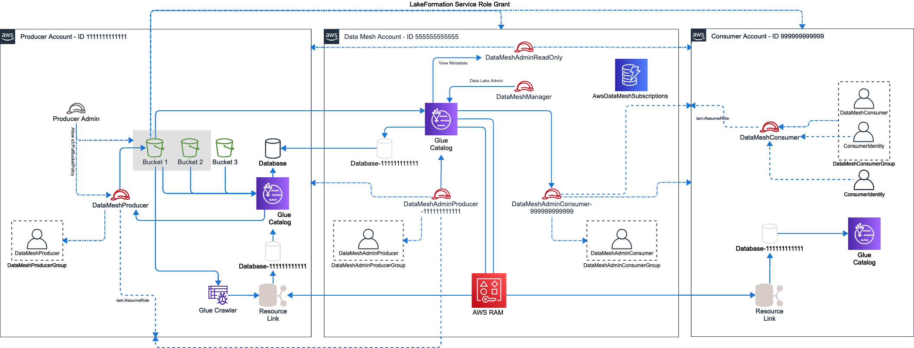

# AWS Data Mesh Helper Library

The AWS Data Mesh Helper library provides automation around the most common tasks that customers need to perform to
implement a data mesh architecture on AWS. A data mesh on AWS uses a central AWS Account (the mesh account) to store the
metadata associated with __Data Products__ created by data __Producers__. This allows other AWS Accounts to act as __
Consumers__, and to request __Subscriptions__, which must be approved by __Producers__. Upon approval, the approved
grants are provided to the __Consumer__
and can be used within their AWS Account.

### Definition of Terms

* __Data Mesh__ - An architectural pattern which provides a centralised environment in which the data sharing contract
  is managed. Data stays within __Producer__ AWS Accounts, and they own the lifecycle of granting __Subscriptions__.
* __Producer__ - Any entity which offers a __Data Product__ through the __Data Mesh__
* __Consumer__ - Any entity who subscribes to a __Data Product__ in the __Data Mesh__
* __Subscription__ - The central record and associated AWS Lake Formation permissions linking a __Data Product__ to a __
  Consumer__
* __Data Product__ - Today, a __Data Product__ is scoped to be only an AWS Lake Formation Table or Database. In future
  this definition may expand.

### The Workflow

To get started, you must first enable an AWS Account as the __Data Mesh__ Account. This is where you will store all Lake
Formation metadata about the __Data Products__ which are offered to __Consumers__. Within this Account, there exist IAM
Roles for __Producer__ and __Consumer__
which allow any AWS Identity who has access to perform tasks within the Data Mesh.

Once you have setup an Account as the __Data Mesh__, you can then activate another AWS Account as a __Producer__, __
Consumer__, or both. All of these tasks are performed by the __Data Mesh Admin__, which is accessible through an
additional IAM Role or as any Administrator Identity within the mesh Account. Once completed, end users can perform the
following Data Mesh tasks:

### Data Mesh Tasks

| Producer | Data Mesh Administrator | Consumer |
|----------|-----------|----------|
|* __Create Data Product__ - Exposes a Lake Formation Database and/or one-or-more Tables as __Data Products__ </br>* __

Approve/Deny Subscription Request__ - Allows for a __
Producer__ to approve a set of permissions against a Data Product  </br>* __Modify Subscription__ - Allows a Producer to
expand or reduce the scope of a Consumer's access to a Data Product | * __
Initialize Mesh Account__ - Sets up an AWS Account to act as the central Data Mesh governance account</br>* __Initialize
Producer Account__ - Sets up an AWS Account to act as a Data Producer </br>* __Initialize Consumer Account__ - Sets up
an AWS Account to act as a Data Consumer </br>* __Enable Account as Producer__ - Identifies an account as a Producer
within the Data Mesh Account </br>* __Enable Account as Consumer__  - Identifies an account as a Consumer within the
Data Mesh Account| * __Request Access to Product__ - Creates a request for access to a Data Product including requested
grants </br>* __Finalize Subscription__ - Once a subscription has been granted for a data product, imports the metadata
into the Consumer Account </br>* __
List Product Access__ - Lists which subscriptions are available to the consumer including the status of the request |

The following general functionality available to any Data Mesh role:

* __Delete Subscription__ - Allows a Consumer or Producer to delete a Subscription request. Can be used at any time.
  Please note the Subscription is not deleted, but instead is archived.
* __List Subscriptions__ - Lists all Subscriptions and their associated status for any number of filters
* __Get Subscription__ - Retrieves a single Subscription

### Overall System Architecture

The following diagram depicts the overall system architecture associated with a Data Mesh that is in use by a single __
Producer__ and __Consumer__:



In this architecture, we can see that the data mesh is configured in AWS Account 555555555555, and contains a set of IAM
Roles which allow identities within producer and consumer accounts to access the mesh. This includes:

* `DataMeshManager`: IAM Role allowing administration of the Data Mesh itself
* `DataMeshAdminProducer`: IAM Role enabling the assuming Identity to act as a __Producer__
* `DataMeshAdminConsumer`: IAM Role enabling the assuming Identity to act as a __Consumer__
* `DataMeshAdminReadOnly`: IAM Role that can be used for reading Metadata from the Data Mesh Account (only)

For testing and simplicity, every IAM Role in the solution is accompanied by a single IAM User who is a member of a
Group specific to the function. This will enable you to add users to this Group should you wish to, rather than using a
programmatic approach. IAM Roles are backed by an IAM Policy of the same name as the Role, and all objects in the IAM
stack for AWS Data Mesh reside at path _/AwsDataMesh/_.

You can then see that there is a Producer Account 111111111111 who has been enabled to act as a __Producer__. Within
this account we see a similar approach to IAM principals, with the creation of a `DataMeshProducer` IAM Role which is
accompanied by an associated user and group. When configured, the `DataMeshProducer` group is granted rights to assume
the `DataMeshProducer-<account id>` role in the data mesh Account.

Similarly, we have a consumer Account 999999999999. This Account also includes IAM objects to enable data mesh access,
including the `DataMeshConsumer` IAM Role, and associated IAM users and groups. Only the `DataMeshConsumer` role may
assume the `DataMeshAdminConsumer-<account id>` role in the data mesh Account.

All information around current or pending subscriptions is stored in DynamoDB, in table `AwsDataMeshSubscriptions`. This
table is secured for only those operations which Producers or Consumer roles are allowed to execute, and stores the
overall lifecycle for Subscriptions.

### Library Structure

This functionality is presented to customers as a Python library to allow maximum re-use. It is divided into 3 modules,
each specific to a persona within the overall Data Mesh architecture:

* `src`
    * `data_mesh_util`
        * [`DataMeshAdmin.py`](doc/DataMeshAdmin.md) - Includes functionality to be performed by the Administrative
          function for each account type
        * [`DataMeshProducer.py`](doc/DataMeshProducer.md) - Includes functionality performed by the Producer persona,
          to create and manage Data Products and manage subscriptions for their products
        * [`DataMeshConsumer.py`](doc/DataMeshConsumer.md) - Includes functionality allowing principals to subscribe to
          Data Products
    * `lib`
        * `constants.py` - Contains constant values used in user or class interaction
        * `SubscriberTracker.py` - Class that manages data product Subscription status
        * `ApiAutomator.py` - Helper class that automates API requests against AWS Accounts
        * `utils.py` - Various utility functions shared across the codebase
    * `resource` - Pystache templates used to generate IAM policies
* `test` - Integration tests of functionality

## Getting Started

To get started with Data Mesh Utils, you must first configure an AWS Account to act as the data mesh account. We
recommend one data mesh account per AWS Region, keeping regional catalogs separated to support data residency
requirements. However, you may choose to only have a single data mesh account for your entire business.

### Step 1 - Install the Data Mesh

Installing the Data Mesh Utility functions must be run as 1/an AWS Administrative account, which 2/has Lake Formation
Data Lake Admin permissions granted. This activity will only be done once. When you have granted the needed permissions,
run the Data Mesh Installer with:

```python
import logging
from data_mesh_util import DataMeshAdmin as dmu

'''
Script to configure an set of accounts as central data mesh. Mesh credentials must have AdministratorAccess and Data Lake Admin permissions.
'''

data_mesh_account = 'insert data mesh account number here
aws_region = 'insert the AWS Region you want to install into'
credentials = {
    "AccessKeyId": "your access key",
    "SecretAccessKey": "your secret key",
    "SessionToken": "optional - a session token, if you are using an IAM Role & temporary credentials"
}

# create the data mesh
mesh_admin = dmu.DataMeshAdmin(
    data_mesh_account_id=data_mesh_account,
    region_name=aws_region,
    log_level=logging.DEBUG,
    use_creds=credentials
)
mesh_admin.initialize_mesh_account()
```

### Step 2 - Enable an AWS Account as a Producer

You must configure an account to act as a Producer in order to offer data shares to other accounts. This is an
administrative task that is run once per AWS Account. The configured credentials must have AdministratorAccess as well
as Lake Formation Data Lake Admin. To setup an account as a Producer, run:

```python
import logging
from data_mesh_util.lib.constants import *
from data_mesh_util import DataMeshMacros as data_mesh_macros

'''
Script to configure an set of accounts as central data mesh. Mesh credentials must have AdministratorAccess and Data Lake Admin permissions.
'''

data_mesh_account = 'insert data mesh account number here
aws_region = 'insert the AWS Region you want to install into'
mesh_credentials = {
    "AccessKeyId": "your access key",
    "SecretAccessKey": "your secret key",
    "SessionToken": "optional - a session token, if you are using an IAM Role & temporary credentials"
}
producer_credentials = {
    "AccountId": "the target AWS Account ID",
    "AccessKeyId": "your access key",
    "SecretAccessKey": "your secret key",
    "SessionToken": "optional - a session token, if you are using an IAM Role & temporary credentials"
}

# create a macro handler which works across accounts
mesh_macros = data_mesh_macros.DataMeshMacros(
    data_mesh_account_id=data_mesh_account,
    region_name=aws_region,
    log_level=logging.DEBUG
)

# configure the producer account
mesh_macros.bootstrap_account(
    account_type=PRODUCER,
    mesh_credentials=mesh_credentials,
    account_credentials=producer_credentials
)
```

### Step 3: Enable an AWS Account as a Consumer

Accounts can be both producers and consumers, so you may wish to run this step against the account used above. You may
also have Accounts that are Consumer only, and cannot create data shares. This step is only run once per AWS Account and
must be run using credentials that have AdministratorAccess as well as being Lake Formation Data Lake Admin:

```python
import logging
from data_mesh_util.lib.constants import *
from data_mesh_util import DataMeshMacros as data_mesh_macros

'''
Script to configure an set of accounts as central data mesh. Mesh credentials must have AdministratorAccess and Data Lake Admin permissions.
'''

data_mesh_account = 'insert data mesh account number here
aws_region = 'insert the AWS Region you want to install into'
mesh_credentials = {
    "AccessKeyId": "your access key",
    "SecretAccessKey": "your secret key",
    "SessionToken": "optional - a session token, if you are using an IAM Role & temporary credentials"
}
consumer_credentials = {
    "AccountId": "the target AWS Account ID",
    "AccessKeyId": "your access key",
    "SecretAccessKey": "your secret key",
    "SessionToken": "optional - a session token, if you are using an IAM Role & temporary credentials"
}

# create a macro handler which works across accounts
mesh_macros = data_mesh_macros.DataMeshMacros(
    data_mesh_account_id=data_mesh_account,
    region_name=aws_region,
    log_level=logging.DEBUG
)

# configure the consumer account
mesh_macros.bootstrap_account(
    account_type=CONSUMER,
    mesh_credentials=mesh_credentials,
    account_credentials=consumer_credentials
)
```

The above Steps 2 and 3 can be run for any number of accounts that you require to act as Producers or Consumers. If you
want to provision an account as both Producer _and_ Consumer, then use `account_type='both'` in the above call
to `bootstrap_account()`.

### Step 4: Create a Data Product

Creating a data product replicates Glue Catalog metadata from the Producer's account into the Data Mesh account, while
leaving the source storage at rest within the Producer. The data mesh objects are shared back to the Producer account to
enable local control without accessing the data mesh. Data Products can be created from Glue Catalog Databases or
one-or-more Tables, but all permissions are managed at Table level. Producers can run this as many times as they require. 
To create a data product:

```python
import logging
from data_mesh_util import DataMeshProducer as dmp

'''
Script to create a data product for an existing Glue Catalog Object
'''

data_mesh_account = 'insert data mesh account number here
aws_region = 'insert the AWS Region you want to install into'
producer_credentials = {
    "AccountId": "The Producer AWS Account ID",
    "AccessKeyId": "Your access key",
    "SecretAccessKey": "Your secret key",
    "SessionToken": "Optional - a session token, if you are using an IAM Role & temporary credentials"
}
data_mesh_producer = dmp.DataMeshProducer(
    data_mesh_account_id=data_mesh_account,
    log_level=logging.DEBUG,
    region_name=aws_region,
    use_credentials=producer_credentials
)

database_name = 'The name of the Glue Catalog Database where the table lives'
table_name = 'The Table Name'
domain_name = 'The name of the Domain which the table should be tagged with'
data_product_name = 'If you are publishing multiple tables, the product name to be used for all'
cron_expr = 'daily'
crawler_role = 'IAM Role that the created Glue Crawler should run as'
create_public_metadata = True if 'Use value True to allow any user to see the shared object in the data mesh otherwise False' else False

data_mesh_producer.create_data_products(
    source_database_name=database_name,
    table_name_regex=table_name,
    domain=domain_name,
    data_product_name=data_product_name,
    create_public_metadata=True,
    sync_mesh_catalog_schedule=cron_expr,
    sync_mesh_crawler_role_arn=crawler_role,
    expose_data_mesh_db_name=None,
    expose_table_references_with_suffix=None
)
```

### Step 5: Request access to a Data Product Table

As a consumer, you can gain view public metadata by assuming

---
Amazon Web Services, 2021 All rights reserved.
